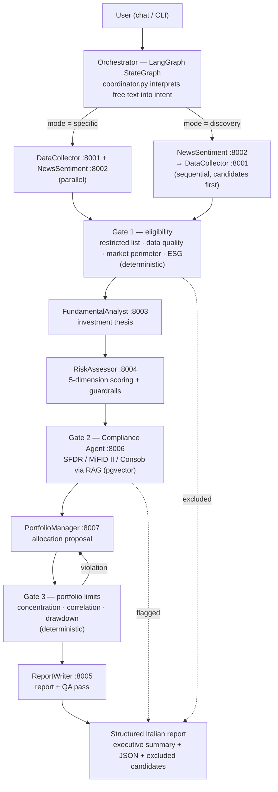

# Equity Researcher A2A

[](https://github.com/tommasobraga-wq/equity-researcher-analyst-a2a/actions/workflows/ci.yml)
[](LICENSE)
[](pyproject.toml)

A multi-agent **equity research pipeline** built on the [A2A (Agent-to-Agent) protocol](https://a2a-protocol.org/): seven independent services — data collection, news sentiment, fundamental analysis, risk assessment, regulatory compliance (RAG), portfolio allocation, and report generation — coordinated by a dynamic [LangGraph](https://www.langchain.com/langgraph) orchestrator and exposed through a natural-language chat + live pipeline trace UI.

It's a personal project built to explore agentic architecture patterns end to end — not a financial product. See [Disclaimer](#disclaimer).

## Contents

- [What it does](#what-it-does)
- [Architecture](#architecture)
- [Why this project](#why-this-project)
- [Quick start](#quick-start)
- [Tech stack](#tech-stack)
- [Project layout](#project-layout)
- [Documentation](#documentation)
- [Disclaimer](#disclaimer)

## What it does

Give it a free-text request — a list of tickers ("confrontami NVDA e AMD") or an open-ended brief ("opportunità nel settore bancario europeo ora") — and the pipeline:

1. collects market fundamentals (yfinance) and financial news (RSS) in parallel or in sequence, depending on whether tickers are already known;
2. screens candidates against a restricted list, data-quality, market-perimeter, and ESG filters (**Gate 1**, deterministic);
3. builds a company-specific investment thesis and a 5-dimension risk score per candidate;
4. checks every candidate against internal policy documents (SFDR, MiFID II, Consob) via retrieval-augmented generation (**Gate 2**);
5. proposes a portfolio allocation and validates it against concentration/correlation limits (**Gate 3**, deterministic);
6. writes a structured Italian-language report with executive summary, base/bull/bear scenarios, and a falsification trigger per thesis, with a QA pass on the output.

Every step is streamed live to a web UI (`gateway/`) showing the pipeline trace, retries, and gate decisions as they happen.

## Architecture



All agent-to-agent calls are JSON-RPC 2.0 over HTTP, each service discoverable via `GET /.well-known/agent.json`. Full protocol details and the two pipeline topologies are documented in [`CLAUDE.md`](CLAUDE.md).

## Why this project

A few decisions worth a closer look if you're evaluating the engineering, not just the pitch:

- **Three-gate compliance model** — two deterministic, zero-LLM-cost gates (restricted list / ESG / market perimeter, portfolio concentration limits) bracket one qualitative RAG gate (regulatory judgment against real SFDR/MiFID II/Consob text). Each gate owns exactly what it can check reliably — the LLM gate never re-derives rules that already live in YAML. Rationale in [ADR 0004](docs/adr/0004-three-gate-compliance.md).
- **Dynamic orchestration topology** — the LangGraph entry point and node order change based on whether the user names tickers or asks an open-ended question, without duplicating pipeline logic. See [ADR 0003](docs/adr/0003-langgraph-dynamic-orchestrator.md).
- **One shared, auditable ReAct loop** instead of a different agent framework per service — a deliberate simplification after the original per-agent framework split turned out to add integration surface without adding coverage. See [ADR 0002](docs/adr/0002-shared-react-loop.md).
- **Resumable runs & conversation memory** — every pipeline stage snapshots state to Postgres, so a run can resume from the last clean stage after a failure instead of restarting; a per-agent circuit breaker was prototyped and deliberately reverted as overengineering for a single-user, single-run system. See [ADR 0007](docs/adr/0007-persistence-resilience.md).
- **Full audit trail & observability** — every A2A call and every LLM call (with token/cost accounting) is logged to Postgres and surfaced on a provisioned Grafana dashboard. See [ADR 0012](docs/adr/0012-observability.md).
- **12 ADRs total**, including two documented reversals (circuit breaker, per-IP rate limiting) — kept specifically so a past decision isn't silently re-tried for a reason already ruled out. Full index in [`docs/adr/`](docs/adr/README.md).
- **104 tests**, CI running against a real Postgres/pgvector service (not mocked) because the Compliance Agent's own startup gate requires it — see [`ci.yml`](.github/workflows/ci.yml).

## Quick start

Requires Python 3.11+, [`uv`](https://docs.astral.sh/uv/), and an `ANTHROPIC_API_KEY`.

```bash
# 1. Install dependencies
uv sync

# 2. Configure environment
cp .env.example .env   # then fill in ANTHROPIC_API_KEY at minimum

# 3. Start every agent + the web UI in one go
./start.sh
```

Then open `http://localhost:8000` for the chat UI, or drive it headlessly:

```bash
# Non-interactive: analyze specific tickers and exit
uv run python orchestrator/main.py --tickers AAPL MSFT UCG.MI

# Interactive multi-turn REPL
uv run python orchestrator/main.py
```

`VOYAGE_API_KEY` + a Postgres instance with the `vector` extension are required only for the Compliance Agent (Gate 2's RAG retrieval); everything else degrades gracefully without a database (`DATABASE_URL` unset ⇒ no audit trail / resumable runs / conversation memory, not a hard failure). A full containerized setup (`docker-compose.yml`, with Postgres/pgvector and optional Grafana) is also available — see [`CLAUDE.md`](CLAUDE.md) for the complete command reference.

## Tech stack

| Layer | Choice |
|---|---|
| Agent framework | Hand-rolled ReAct loop on the Anthropic SDK (`shared/react_agent.py`) |
| Models | `claude-haiku-4-5` (collection/analysis agents) · `claude-sonnet-5` (compliance, portfolio, report writing) |
| Orchestration | LangGraph `StateGraph`, dynamic topology |
| Inter-agent protocol | A2A — JSON-RPC 2.0 over HTTP, HMAC-signed (opt-in) |
| RAG | Voyage AI embeddings + pgvector |
| Persistence | Postgres (`asyncpg`), versioned via Alembic |
| Web UI | FastAPI + SSE + vanilla JS (`gateway/`) |
| Observability | Grafana over an `audit_log` Postgres table |
| Data sources | yfinance (fundamentals), RSS (news) — no paid data feeds |
| Packaging | `uv`, Docker Compose (profiled: full / observability / tools) |

## Project layout

```
agents/            7 independent FastAPI services (one per pipeline stage)
orchestrator/       LangGraph pipeline + natural-language coordinator
gateway/            web UI (chat + live pipeline trace)
shared/             A2A protocol, ReAct loop, auth, audit, RAG, gates, tools
policies/           YAML rule sets (Gate 1/3) + regulatory PDFs (Gate 2 RAG corpus)
alembic/            versioned schema migrations
observability/      provisioned Grafana dashboard + datasource
docs/adr/           architecture decision records
tests/              104 tests (unit + integration + smoke)
```

## Documentation

- [`CLAUDE.md`](CLAUDE.md) — full command reference and architecture deep-dive (this is the canonical technical doc).
- [`docs/adr/`](docs/adr/README.md) — architecture decision records, one per major design choice, including reasoning behind reversals.
- [`docs/history/`](docs/history/) — earlier planning notes, kept for reference; superseded by the above.

## Disclaimer

This is a personal, self-directed learning project exploring agentic AI architecture patterns (A2A protocol, multi-agent orchestration, RAG, deterministic guardrails). It uses only public data sources (yfinance, public RSS feeds) and public regulatory texts. It is **not investment advice**, is not affiliated with or endorsed by any employer past or present, and is not connected to any client work or proprietary methodology. Reports it generates are illustrative output of an architecture demo, not research to act on.

## License

[MIT](LICENSE)
